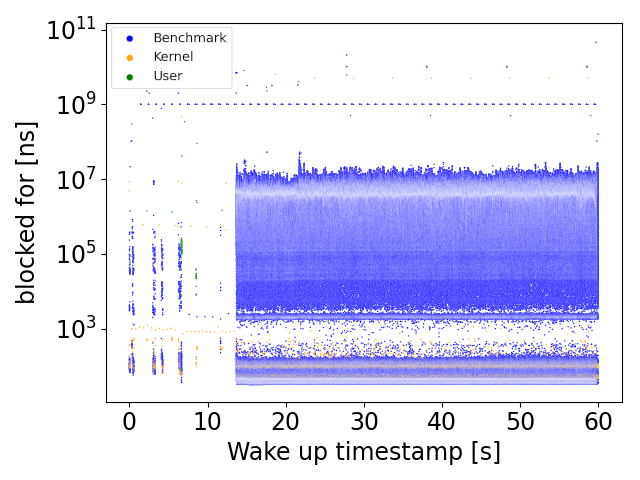
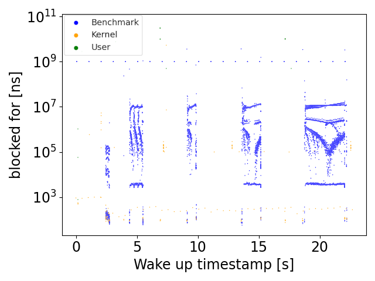
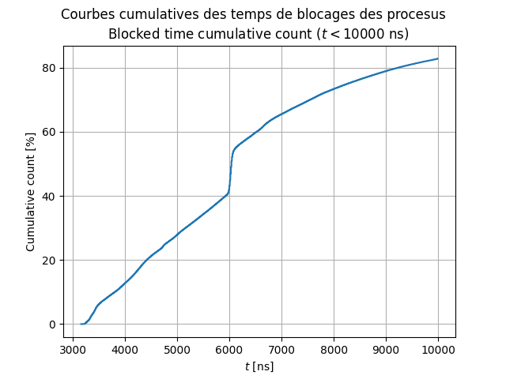

# SchedViz

Ce dépot contient les modules, scripts pour pouvoir analyser les temps de blocages des threads dans Linux v5.17.
Ces travaux ont été réalisé dans le cadre de la thèse de Baptiste Pires.

# `module/`
Ce répertoire contient le code du module noyau Linux à insérer qui va s'occuper de réaliser les mesures et de les stocker. Il faut un noyau Linux v5.17 patché qui se trouve dans `kernel/`.

# `user/`
Ce répertoire contient tout le code userspace qui permet de lancer, mesurer, analyser et produire des graphiques.

Le script `monitor_cmd.sh` permet de monitorer une commande :  
1) Le module va être inséré
2) La commande passée en paramètre va être lancée et ses processus/threads vont être tagués pour pouvoir suivre leur exécution.
3) A la fin de l'exécution de la commande, les données vont être récupérées via le `sysfs`.
4) Finalement, nous pouvons analyser les données.  
> Il est possible de générer plusieurs courbes, par exemple :   
---

Graphique représentant les blocages des threads. En abscisses nous avons l'heure de réveil et en ordonnées la durée du blocage. Les couleurs des points correspondent aux types de threads (benchmark (notre application), other (threads userspace autre que notre application) et kernel).

Profil pour `apache-siege`
---

Profile pour `compresss-7zip`
---

Il est également possible de générer des courbes cumulative des blocages pour mieux visualiser la distribution de ces derniers, comme sur ce graphique :

Courbe cumulative des blocages pour l'application `hackbench`
---

# `kernel/`

Linux kernel `v5.17` patché pour pouvoir insérer le module.